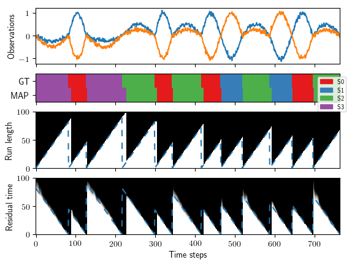
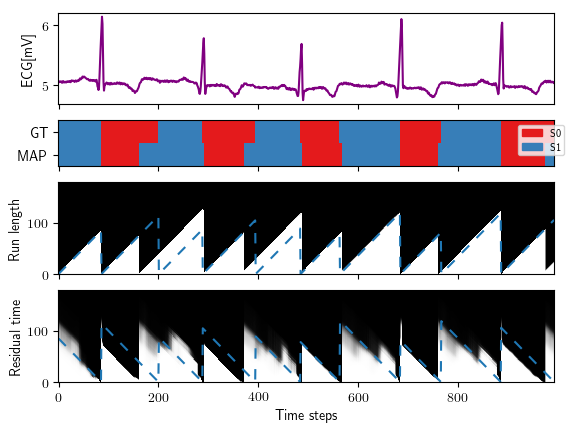

### Online Hidden-semi Markov Models for Bayesian Online Detection and Prediction of Change Points

Implementation of Online HSMMs which eases the implementation of custom emission processes. In particular, emission processes which jointly depend on the hidden state and duration are supported.

There is also a python script for plotting the inferences drawn from the model.

#### Requirements

The framework requires the following ubuntu packages:

```
sudo apt-get install libboost-all-dev nlohmann-json-dev libarmadillo-dev cmake
```

Once you have installed these basic dependencies you can use some vanilla emission processes (e.g., i.i.d. Gaussian model) and create your own custom emission models. If you want to reproduce the paper results and/or use other already-implemented more advanced observation models you'll need to install two extra dependencies:
* mlpack 3.0.4
* Probabilistic Movement Primitives (ProMPs)

Installation instructions for mlpack can be foud [here](https://www.mlpack.org/docs/mlpack-3.0.4/doxygen/build.html) and for ProMPs go [here](https://github.com/sebasutp/promp-cpp). Please note that both dependencies are built similarly to this project using cmake, which make things easier.

#### Building

Follow the standard procedure for building cmake projects. Once you are in the repository main directory type:
```
mkdir build
cd build
cmake ..
make
```
The latter will only build executables for which the dependencies are fulfilled. Make sure your mlpack and ProMPs installations are discoverable by cmake if you want to build their respective examples.

#### Examples

Examples of HSMMs with different emission processes can be found in the examples folder distributed with the code.

#### Plots

The paper plots can be reproduced by typing the following commands in the plots directory of this repository.
```
sh plot_cmd_synth
sh plot_cmd_ecg
```
As a result you'll get the following plots:

Synthetic experiment:


ECG experiment:


The sh scripts call the plotting script with the right arguments to get the same plots reported in the paper. Note that you don't need to install anything to obtain the plots given that the output inferences of the model are included in the repository as matrices.

The output matrices for the EEG/EMG experiment are not provided because they would increase the repository size considerably. Instructions about how to generate them once the project is built will be provided (TODO).

#### References

Please cite the paper *Bayesian Online Detection and Prediction of Change Points* (https://arxiv.org/abs/1902.04524) if you find this work useful.
